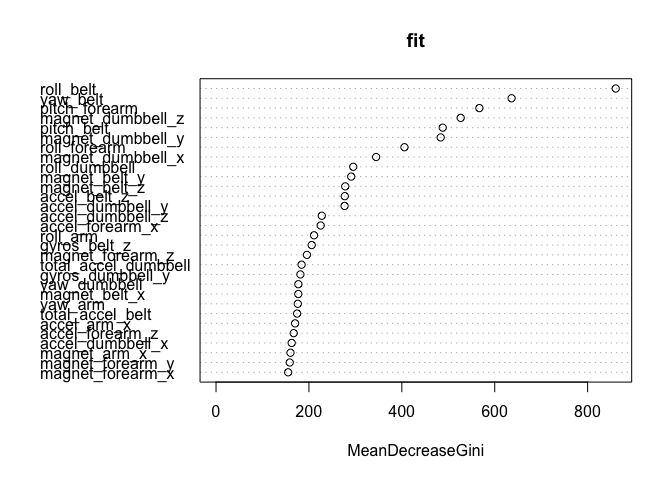

# Activity Recognition Machine Learinig Coursera Assignment
Omar Gomez  
November 23, 2014  


Executive Summary
-----------------

From Medicine to Social sciences, Human Activity Recognition (HAR) has raised as an important field with many applications. This article shows how Machine Learning techniques can be used to identify different kinds of activties when working out with a dumbbell, more specifically it differiantes good executions from bad executions using data recollected by sensors attached to the performer. 

Data cleaning and exploration
-----------------------------

The data for this study come from previous work. It uses results obtained by Velloso and others for a research titled [Qualitative Activity Recognition of Weight Lifting Exercises](http://groupware.les.inf.puc-rio.br/work.jsf?p1=11201). The training data set was made available by Coursera and can be downloaded from [https://d396qusza40orc.cloudfront.net/predmachlearn/pml-training.csv](https://d396qusza40orc.cloudfront.net/predmachlearn/pml-training.csv).


```r
training_csv<-read.csv("pml-training.csv",na.strings=c("NA",""))
```

This data set contains 19622 rows and 160 columns. 

Since no documentation on the structure of the data set exists, it is hopped the data be self explanatory. 

### Cleaning

The first seven columns contains sequence or timestamp information specific for the experiment and is of no use for this study:


```r
colnames( training_csv[,1:7] )
```

```
## [1] "X"                    "user_name"            "raw_timestamp_part_1"
## [4] "raw_timestamp_part_2" "cvtd_timestamp"       "new_window"          
## [7] "num_window"
```

The first step is to clean these columns:


```r
training_no_seq <- training_csv[,-(1:7)]
```

There are also columns designed to hold aggregate data that in this sample contains NA's, so secondly we get rif of this columns:


```r
not_na <- apply(!is.na(training_no_seq),2,sum) == nrow(training_no_seq)
training<-training_no_seq[,not_na]
```

Our final data sets gets reduced to just 53 variables. These variables recollect data from the four sensors used for the study: one on the belt and three more on the arm, the wirst, and the dumbbell itself (dumbbell variables are shown):


```r
cnames <- colnames( training )
cnames[ grepl("dumbbell", cnames) ]
```

```
##  [1] "roll_dumbbell"        "pitch_dumbbell"       "yaw_dumbbell"        
##  [4] "total_accel_dumbbell" "gyros_dumbbell_x"     "gyros_dumbbell_y"    
##  [7] "gyros_dumbbell_z"     "accel_dumbbell_x"     "accel_dumbbell_y"    
## [10] "accel_dumbbell_z"     "magnet_dumbbell_x"    "magnet_dumbbell_y"   
## [13] "magnet_dumbbell_z"
```

These are 13 variables with lectures from the magnetometer (x,y,z), the accelerometer (x,y,z,total) and the gyroscope (x,y,z,roll,pitch,yaw).

There is just one more variable, 'classe' which is actually the one we want to predict from the other ones, it's a 5 level variable:


```r
levels(training$classe)
```

```
## [1] "A" "B" "C" "D" "E"
```

These values correspond to:

* A: Execution according to specification
* B: Throwing the elbows to the front
* C: Lifting the dumbbell only halfway
* D: Lowering the dumbbell only halfway
* E: Throwing the hips to the front

The Model
---------

Let's apply Tree techniques to predict the class of the activity performed using our sensor data. First step is partition our data:


```r
set.seed(1234)
inTrain <- createDataPartition( y=training$classe, p=0.7, list=FALSE )
har_train <- training[inTrain,]
har_test <- training[-inTrain,]
c( nrow(har_train), nrow(har_test) )
```

```
## [1] 13737  5885
```

And then lets fit our model using Random Forest ( This was chosen due to its accuracy and low overfitting ):


```r
fit <- randomForest( classe ~ ., data=har_train )
print(fit)
```

```
## 
## Call:
##  randomForest(formula = classe ~ ., data = har_train) 
##                Type of random forest: classification
##                      Number of trees: 500
## No. of variables tried at each split: 7
## 
##         OOB estimate of  error rate: 0.51%
## Confusion matrix:
##      A    B    C    D    E class.error
## A 3902    3    0    0    1    0.001024
## B   12 2643    3    0    0    0.005643
## C    0   14 2380    2    0    0.006678
## D    0    0   26 2225    1    0.011989
## E    0    0    2    6 2517    0.003168
```

Analysis
--------

### Variable Importance

 

This graph shows how each variable adds information to our model, we can conclude for example that sensors at the belt and the dumbbell were the most effective.

### Accuracy


```r
pred_train <- predict(fit, har_train)
result_train <- confusionMatrix(pred_train, har_train$classe)
pred_test <- predict(fit, har_test)
result_test <- confusionMatrix(pred_test, har_test$classe)
result_test
```

```
## Confusion Matrix and Statistics
## 
##           Reference
## Prediction    A    B    C    D    E
##          A 1674    8    0    0    0
##          B    0 1130    5    0    0
##          C    0    1 1021    4    0
##          D    0    0    0  959    1
##          E    0    0    0    1 1081
## 
## Overall Statistics
##                                         
##                Accuracy : 0.997         
##                  95% CI : (0.995, 0.998)
##     No Information Rate : 0.284         
##     P-Value [Acc > NIR] : <2e-16        
##                                         
##                   Kappa : 0.996         
##  Mcnemar's Test P-Value : NA            
## 
## Statistics by Class:
## 
##                      Class: A Class: B Class: C Class: D Class: E
## Sensitivity             1.000    0.992    0.995    0.995    0.999
## Specificity             0.998    0.999    0.999    1.000    1.000
## Pos Pred Value          0.995    0.996    0.995    0.999    0.999
## Neg Pred Value          1.000    0.998    0.999    0.999    1.000
## Prevalence              0.284    0.194    0.174    0.164    0.184
## Detection Rate          0.284    0.192    0.173    0.163    0.184
## Detection Prevalence    0.286    0.193    0.174    0.163    0.184
## Balanced Accuracy       0.999    0.996    0.997    0.997    0.999
```

**In Sample Accuracy**


```r
result_train$overall
```

```
##       Accuracy          Kappa  AccuracyLower  AccuracyUpper   AccuracyNull 
##         1.0000         1.0000         0.9997         1.0000         0.2843 
## AccuracyPValue  McnemarPValue 
##         0.0000            NaN
```


**Out of Sample Accuracy**


```r
result_test$overall
```

```
##       Accuracy          Kappa  AccuracyLower  AccuracyUpper   AccuracyNull 
##         0.9966         0.9957         0.9948         0.9979         0.2845 
## AccuracyPValue  McnemarPValue 
##         0.0000            NaN
```

With only 20 misses in our out of sample prediction, we have found a high accuracy model.

Prediction
----------

Let's predict our testing sample:


```r
testing_csv<-read.csv("pml-testing.csv",na.strings=c("NA",""))
testing_csv$prediction <- predict(fit, testing_csv)
testing_csv[, c("problem_id","prediction")]
```

```
##    problem_id prediction
## 1           1          B
## 2           2          A
## 3           3          B
## 4           4          A
## 5           5          A
## 6           6          E
## 7           7          D
## 8           8          B
## 9           9          A
## 10         10          A
## 11         11          B
## 12         12          C
## 13         13          B
## 14         14          A
## 15         15          E
## 16         16          E
## 17         17          A
## 18         18          B
## 19         19          B
## 20         20          B
```

